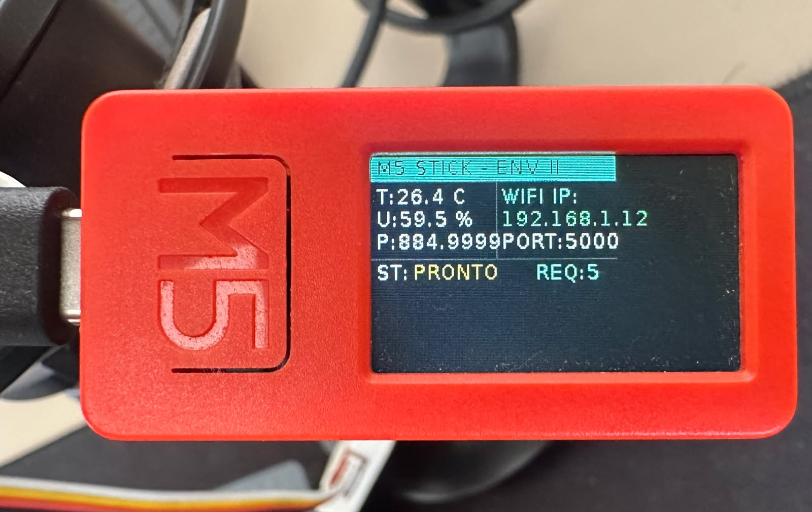

# MCP Agent - M5Stick ENV2

Este repositório contém a implementação completa de um Agente MCP (Model Context Protocol) integrado a um sensor físico de temperatura, umidade e pressão **M5Stick ENV2** rodando em um cluster Kubernetes.

A arquitetura permite que assistentes de IA (como o **Rancher Liz Assistant**) consultem métricas ambientais em tempo real diretamente de um hardware físico conectado à internet.

## 📱 Estrutura do Projeto

- `m5stick_env2.py`: Código em MicroPython para gravar no M5Stick que lê o sensor e serve os dados via HTTP.
- `server.py`: Servidor MCP Agent em Python utilizando `fastmcp` para expor as ferramentas de leitura do sensor.
- `Dockerfile`: Configuração para containerizar o servidor MCP.
- `k8s-manifest.yaml`: Manifesto de Deployment, Service (NodePort) e Namespace para o Kubernetes.
- `requirements.txt`: Dependências necessárias para rodar o servidor Python.

## ⚡ Implantação Direta e Rápida (Sem compilar)

Se você não deseja buildar a imagem e prefere subir o agente no seu Kubernetes de forma imediata, você pode utilizar a imagem pré-compilada oficial disponível publicamente no Docker Hub: **`gabriellins/mcp-m5stick-agent:latest`**.

### Passo Único no Kubernetes

Certifique-se de que o seu M5Stick está ligado e exposto em um endereço acessível (como `metricas.suseverse.com`). Depois, basta rodar o comando abaixo para aplicar o manifesto padrão utilizando a imagem pronta:

```
kubectl apply -f k8s-manifest.yaml
```

*Nota: Se precisar alterar o domínio de destino, basta editar a variável `M5STICK_HOST` no arquivo `k8s-manifest.yaml` antes de aplicar.*

## 🚀 Como Configurar e Implantar (Passo a Passo Completo)

### 1. Gravar o M5Stick

1. Configure o seu M5Stick com o firmware do MicroPython/UIFlow.
2. Certifique-se de que o seu sensor **ENV2** está conectado na **Porta A**.
3. Atualize as credenciais do Wi-Fi no arquivo `m5stick_env2.py`:

```
wifi.connect('NOME_DA_REDE', 'SENHA_DA_REDE')
```

1. Grave o arquivo `m5stick_env2.py` no seu dispositivo. Ele inicializará exibindo o IP recebido na tela, as métricas do sensor em tempo real e um contador de requisições que piscará a cada chamada bem-sucedida.

### 2. Build e Push da Imagem Personalizada (Opcional)

Se você realizou modificações no código do `server.py` e deseja gerar sua própria imagem:

```
# Build da imagem
docker build -t gabriellins/mcp-m5stick-agent:latest .

# Push da imagem para o Docker Hub
docker push gabriellins/mcp-m5stick-agent:latest
```

### 3. Deploy no Kubernetes

1. Abra o arquivo `k8s-manifest.yaml` e garanta que o campo de imagem aponta para a imagem correta:

```
spec:
  containers:
  - name: mcp-server
    image: gabriellins/mcp-m5stick-agent:latest
```

1. Certifique-se de que as variáveis de ambiente apontam para a URL pública do seu sensor:

```
- name: M5STICK_HOST
  value: "metricas.suseverse.com"
```

1. Aplique o manifesto no seu cluster:

```
kubectl apply -f k8s-manifest.yaml
```

### 4. Integração com a Rancher Liz Assistant

1. Descubra a porta aleatória (`NodePort`) criada para o serviço executando:

```
kubectl get svc mcp-m5stick-service -n mcp-agents
```

1. No painel da **Rancher Liz**, adicione um novo Agente com a configuração MCP apontando para o seu Node IP e a NodePort correspondente utilizando o transporte padrão do GoFastMCP (`/mcp`):
- **Endpoint:** `http://<IP-DO-NODE-K8S>:<NODEPORT>/mcp`

## 📋 Configuração Recomendada na Rancher Liz

Ao cadastrar este agente na interface do **Rancher Liz Assistant**, utilize as definições abaixo para garantir que a IA se comporte e interprete as métricas físicas de forma correta e segura:

### Agent Profile

```
Este agente é um especialista em monitoramento ambiental e telemetria de hardware integrado ao cluster Kubernetes. Ele atua como uma interface inteligente entre os sensores físicos M5Stick (rodando em mcp-agents) e o plano de controle do Rancher. Sua função principal é extrair, interpretar e relatar métricas de temperatura, umidade e pressão atmosférica em tempo real, fornecendo insights sobre a saúde física do ambiente onde o cluster está operando.
```

### Guidelines

- **Prioridade de Dados**: Sempre utilize a ferramenta `get_environment_data` (ou equivalente no seu MCP) para obter dados em tempo real antes de responder a qualquer pergunta sobre o ambiente. Nunca estime ou invente valores.
- **Contextualização de Métricas**: Ao relatar a temperatura, avalie se os valores estão dentro de uma faixa operacional segura para equipamentos de TI (ex: 18°C a 27°C). Caso a temperatura exceda 30°C, inclua um aviso de **"Alerta de Calor"** na resposta.
- **Unidades de Medida**: Mantenha sempre o padrão decimal brasileiro. Use Celsius (°C) para temperatura e hPa para pressão.
- **Tratamento de Erros**: Se o serviço interno `mcp-m5stick-service` não responder, informe ao usuário que houve uma falha na comunicação interna do Kubernetes no namespace `mcp-agents` e sugira verificar o status do Pod.
- **Concisão**: Seja direto. Os usuários deste agente geralmente buscam monitoramento rápido. Exemplo de resposta ideal: *"A temperatura atual é de 24.5°C com 55% de umidade. O ambiente está estável."*
- **Privacidade**: Não exponha detalhes internos de IPs do cluster, a menos que seja explicitamente solicitado para fins de depuração (debug).

## 🛠️ Tecnologias Utilizadas

- **MicroPython** (para programação embarcada no ESP32/M5Stick)
- **Python 3.11** & **FastMCP** (GoFastMCP)
- **Docker**
- **Kubernetes** (Namespace, Deployment, NodePort Service)
- **Model Context Protocol (MCP)**



Desenvolvido com ❤️ para conectar o mundo físico às inteligências artificiais.
